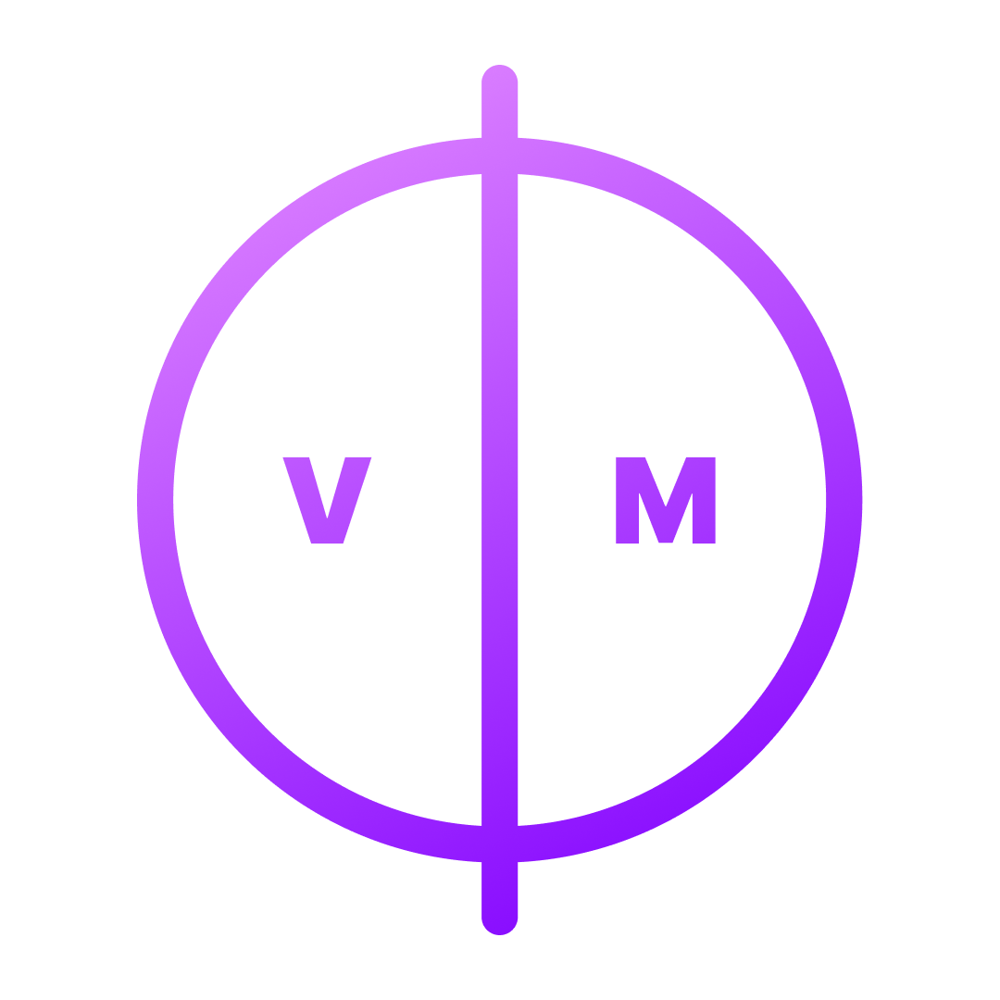

<p align="center">
  <a href="https://github.com/danecwalker/ponic" rel="noopener">
 </a>
</p>

<h3 align="center">PonicVM</h3>

<div align="center">

[]()
[](https://github.com/danecwalker/ponic/issues)
[](https://github.com/danecwalker/ponic/pulls)
[](/LICENSE)

</div>

---

<p align="center"> PonicVM is a register-based virtual machine for the Ponic language
 <br> 
</p>

`Hello World`


`Greet`


`Fibonacci Sequence`


## 📝 Table of Contents

- [Getting Started](#getting_started)
- [Roadmap](#roadmap)
- [Authors](#authors)

## 🏁 Getting Started <a name = "getting_started"></a>

### Prerequisites

The project requires you to have Go installed.

```
brew install go
```

### Installing

Clone the repo

```
git clone https://github.com/danecwalker/ponic
```

Run the compiler (currently uses the ./examples/example.pc)

```
go run .
```

## Roadmap


## ✍️ Authors <a name = "authors"></a>

- [@devdane](https://github.com/danecwalker)